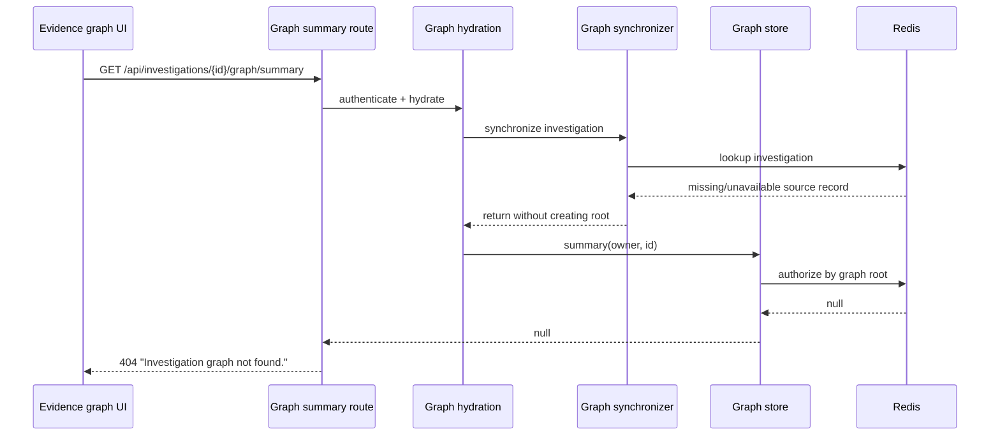
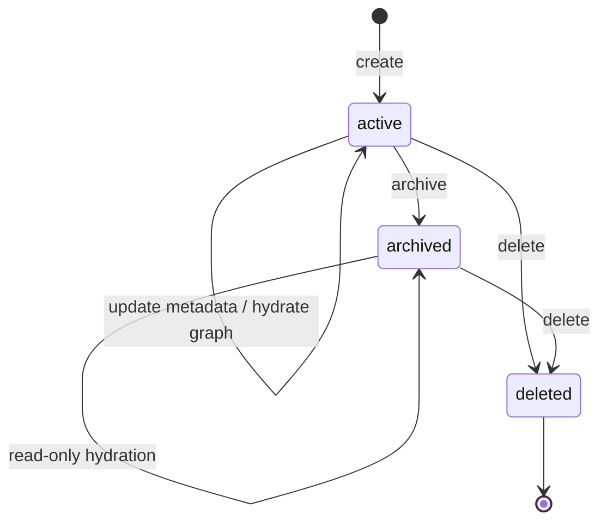
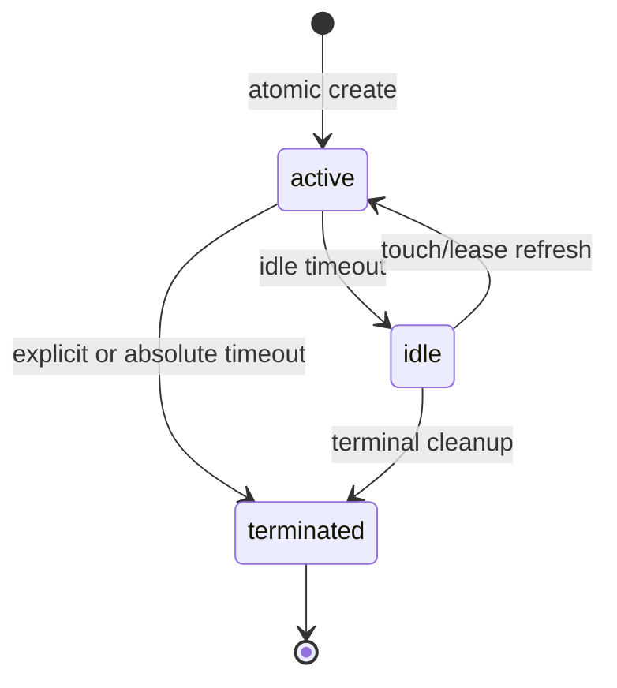
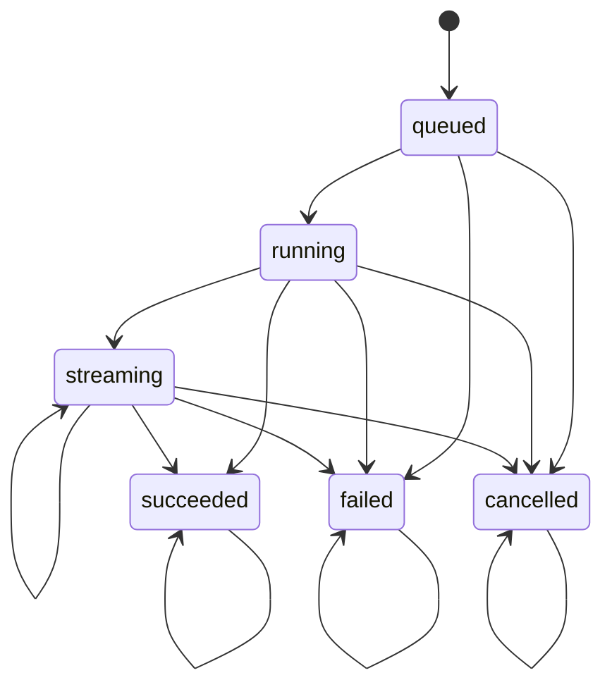
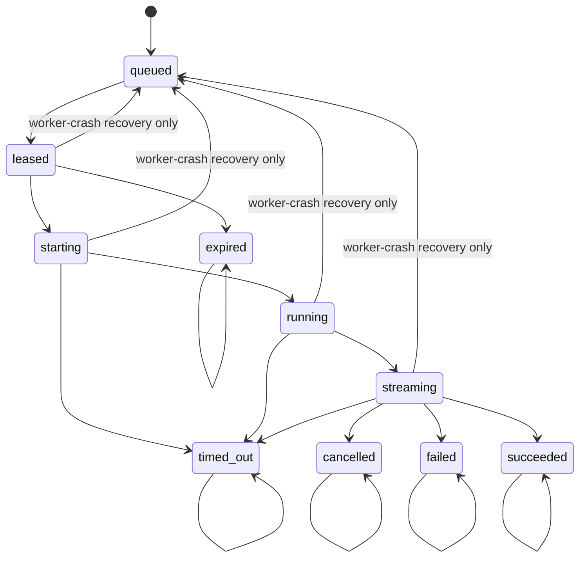
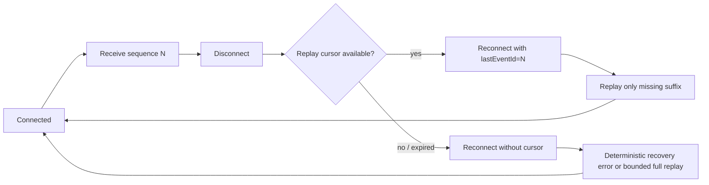

# Hexical AI production incident: investigation graph summary 404

Date: 2026-08-09  
Status: code-level root cause verified and hardened; production deployment verification pending

## Executive conclusion

The supplied response was not a missing Next.js route. Vercel reported `x-matched-path: /api/investigations/[id]/graph/summary`, so the request reached the intended handler. The handler returned its own `404 NOT_FOUND` response because the graph store could not find an authorized graph root for an otherwise valid investigation.

The failure was a durability/hydration defect: graph-root creation was coupled to the synchronizer, while the summary endpoint treated a missing root as a missing graph. A new investigation, a graph with no observations, or a partial Redis restore could therefore return 404 even when the investigation itself existed. The related 503/409 symptoms came from a second admission race: durable queue admission and web-worker activation were treated as one operation, so temporary activation failure was reported as if admission had failed. The UI screenshot is also consistent with stale client state: the error banner was authoritative for the failed request, while visible counts could remain from an earlier successful read.

The permanent repair makes root creation idempotent and part of every graph read, repairs missing entity/edge indexes, preserves the maximum observation timestamp, adds correlation logging, retries execution admission after an atomic session disappearance, prunes idle-expired session index members, prevents terminal investigation executions from being resurrected, and reconnects SSE streams from the last acknowledged sequence.

## Reconstructed failure chain

This was a compound failure rather than a route-registration problem:

1. The route was matched correctly.
2. Hydration depended on the synchronizer to create the graph root.
3. Synchronization could return early when the source investigation was unavailable.
4. `summary()` authorized through the graph root and returned `null` when that root was absent.
5. The API mapped that `null` to a 404, conflating an empty/corrupt graph with a nonexistent investigation.

The supplied request headers establish the route match and the screenshot establishes the handler message. The exact deployed commit, response JSON body, and production Redis contents were not available in this workspace, so those three production facts remain to be confirmed after deployment.

## Durable state machines

### Investigation lifecycle

Deleted investigations fail closed. Active and archived investigations are valid graph hydration sources. Graph reads repair the root but never recreate a deleted investigation.

### Session lifecycle

The idle status key is authoritative for liveness. The durable owner index is now lazily pruned when the status key expires, preventing a dead session from blocking replacement creation.

### Investigation execution lifecycle

Terminal investigation execution states are idempotent and cannot transition back to queued/running/streaming or to a different terminal state.

### TTY runtime execution lifecycle

The recovery-only edges are not available to ordinary coordinator transitions;
they require stale-lease confirmation and a compare-and-set state write.

### Browser stream recovery

The browser URL carries the replay cursor because native `EventSource` cannot set an arbitrary `Last-Event-ID` request header. The route accepts the query cursor and gives the header precedence when a non-browser client supplies it.

## Redis and persistence audit

The investigation, evidence graph, TTY session, execution, stream, worker lease, and recovery paths inspected in this repository are Redis-backed. No relational database write is in the request path for these records. Supabase appears in entitlement/authentication support code, not as the source of truth for the graph or investigation lifecycle.

Key families audited:

- Investigations: `hexical:investigations:record:{id}`, owner index, execution records/indexes, session binding, timeline stream and dedupe, bookmarks, and counters.
- Evidence graph: `hexical:evidence-graph:entity:{investigation}:{entity}`, entity/type/lookup indexes, edge/source/target/relationship/execution indexes, processed-event indexes, and `last-updated`.
- TTY session: `tty:session:{session}:core`, `status`, `terminal`, active-execution and queue counters, execution window, jobs, and idempotency records; the user-session index is durable and lazily repaired.
- TTY execution: `tty:job:{execution}`, execution state, output stream/sequence, browser live stream/sequence, runtime metadata, active index, worker lease indexes, and worker audit stream.

The production audit still required after deployment is a read-only inspection of these exact namespaces for the affected investigation and session: record existence, owner/index membership, graph root/index consistency, execution attachment, state transitions, stream sequence continuity, lease ownership, and TTLs. No live Redis inspection was run from this workspace.

## Implemented repair

- Evidence graph root creation is now an atomic, idempotent repair operation invoked before synchronization and inside `summary()` itself. It repairs the root object, owner lookup, and entity/type indexes.
- Entity and edge upserts always repair their indexes, including after a partial Redis restore. Observation ingestion updates `lastUpdatedAt` with a monotonic maximum rather than trusting batch order.
- Graph hydration now emits correlation-linked `evidence_graph.hydration_started`, `investigation_unavailable`, `root_repaired`, `hydration_completed`, and `summary_loaded` events.
- Investigation execution attachment retries exactly once when the session disappears between ensure and admission, covering both `SESSION_TERMINATED`/409 and `SESSION_NOT_FOUND`/404. Session ensure also reuses an idle, nonterminal session.
- Durable admission now returns 202 with `activationPending` when web activation is temporarily unavailable, eliminating the false 503 and duplicate browser submissions.
- Idle-expired sessions are removed from the owner index during liveness checks, so stale entries cannot prevent self-healing replacement creation.
- Investigation execution history rejects illegal backward or cross-terminal transitions.
- Investigation record, session binding, execution attachment, deletion, and execution updates use compare-and-set Redis scripts; duplicate attachment and termination races are idempotent and concurrent counter updates cannot overwrite state snapshots.
- One-active-session creation is an atomic Redis operation that repairs stale owner pointers while preventing two concurrent creations from both becoming active.
- Queued-job claim removes a queued job and its counters atomically when its session is already terminated, preventing durable idle-session work from being left orphaned.
- Normal TTY transitions cannot move back to `queued`; only the explicit worker-crash recovery constructor can requeue leased/starting/running/streaming work.
- Durable output sequence allocation and `XADD` are one Redis script. Browser live sequence allocation and `XADD` are also one script and no longer fall back to an instance-local cursor during Redis failure.
- SSE reconnection resumes from the last sequence, supports a browser-safe query cursor, and keeps the execution-not-found callback stable across parent rerenders.
- Graph refresh clears all previously displayed graph data on any failed current request, not only 404, so an error cannot sit beside stale counts. Entity and connected-detail failures clear stale selections as well.

Primary implementation files:

- `lib/evidence-graph/evidence-graph-store.ts`
- `lib/evidence-graph/evidence-graph-api.ts`
- `lib/investigations/investigation-api.ts`
- `lib/investigations/investigation-store.ts`
- `lib/investigations/investigation-types.ts`
- `lib/tty/tty-session-store.ts`
- `lib/tty/tty-stream-client.ts`
- `app/api/tty/executions/[executionId]/stream/route.ts`
- `hooks/useTTYExecutionStream.ts`
- `hooks/useEvidenceGraph.ts`
- `lib/tty/tty-execution-state.ts`
- `lib/tty/tty-execution-coordinator.ts`
- `lib/tty/tty-output-stream.ts`
- `lib/tty/tty-stream-broker.ts`

## Race-condition audit

| Race exercised                                  | Durable guard                                                                  | Result                                                                   |
| ----------------------------------------------- | ------------------------------------------------------------------------------ | ------------------------------------------------------------------------ |
| Two session creations for one owner             | Atomic active-session Redis script                                             | One active session; both callers converge on the same ID                 |
| Session expiry during admission/claim           | One retry at the investigation boundary plus atomic terminated-session cleanup | Replacement or durable queued state; no false duplicate submission       |
| Duplicate execution admission/activation        | Idempotency reservation plus execution state/CAS checks                        | One job and one activation; duplicate calls replay the existing result   |
| Terminal execution versus update/recovery       | Terminal-aware state transition guard                                          | Terminal state remains immutable                                         |
| Worker restart during streaming                 | Lease observation, orphan runtime cleanup, recovery-only requeue               | Recovery is idempotent; orphan process/runtime cleanup is retried        |
| Concurrent graph synchronization and index loss | Idempotent upsert plus index repair and processed-sequence dedupe              | No duplicate graph entities/edges; indexes self-heal                     |
| Browser reconnect during replay                 | Serialized broker subscription, cursor validation, gap detection               | Ordered suffix replay or deterministic `STREAM_GAP`/`STREAM_UNAVAILABLE` |
| Parent rerender and stale callbacks             | Stable callback ref and investigation-scoped session promise                   | No spurious reconnect or cross-investigation session reuse               |

The local suite includes 100 repeated real-process execution runs, 100
concurrent worker-registration/recovery cases, 100 concurrent stream viewers,
concurrent graph synchronization, duplicate admission, lease termination, and
Redis-failure cases. Live Redis/Vercel race execution remains a deployment gate
because this workspace has no production credentials or deployment control.

## Recovery and observability audit

Recovery is fail-closed and replay-safe for missing graph roots/indexes, expired
session indexes, terminated queued jobs, stale leases, orphan runtime metadata,
missing stream cursors, and bounded replay-window exhaustion. Every recovery
operation is idempotent or guarded by a compare-and-set/terminal check. The
structured telemetry path carries correlation IDs through graph hydration,
investigation admission, session/execution attachment, activation, state
transition, stream replay, and worker recovery; failure logs carry reason codes
and never expose worker lease secrets.

## Verification completed

- TypeScript no-emit check: passed.
- Production Next.js build: passed; the graph summary route is present as a dynamic route.
- Evidence graph suite: 13/13 passed.
- Investigation suite: 31/31 passed.
- TTY session/lifecycle focused suite: 17/17 passed.
- TTY admission suite: 8/8 passed.
- TTY runtime/recovery suite: 25/25 passed, including 100 repeated live execution E2E iterations.
- TTY stream suite: 17/17 passed, including Redis sequence-failure fail-closed behavior.
- TTY frontend suite: 9/9 passed.
- Full TTY worker/runtime/recovery suite: 94/94 passed.
- `git diff --check`: passed.

The repository lint command could not run because `eslint` is not installed or declared in `devDependencies`; this is a separate release-tooling defect and was not silently treated as a pass.

## Production release gate

The code and local regression evidence are ready for staging/canary. Production readiness is not fully attestable until the deployment is made and the following workflow is executed against the affected investigation:

1. Read the investigation record and owner index.
2. Call graph summary on a new empty investigation; expect 200 with the investigation root counted.
3. Delete only the graph root in a controlled staging fixture; call summary; expect root repair and 200.
4. Remove a graph entity/edge index member in a controlled staging fixture; call the relevant list endpoint; expect index repair.
5. Verify `lastUpdatedAt` never moves backward.
6. Refresh the UI and confirm no stale graph counts remain after a 404/5xx response.
7. Attach execution with a live session.
8. Race attachment against session expiry; expect one replacement session and one admitted execution.
9. Exercise queued, running, streaming, succeeded, failed, and cancelled transitions.
10. Attempt terminal-to-queued mutation; expect rejection/no state change.
11. Disconnect SSE after a known sequence; reconnect and verify suffix replay only.
12. Expire the replay window; verify deterministic recovery behavior.
13. Restart the worker during execution; verify lease/runtime reconciliation.
14. Verify no orphan job, active index member, runtime record, or worker lease remains.
15. Confirm investigation timeline and execution history survive API/worker restart.
16. Verify owner isolation and deleted-investigation fail-closed behavior.
17. Confirm correlation IDs connect graph request, investigation execution, session, and worker logs.
18. Inspect Redis TTLs and indexes for the affected IDs.
19. Confirm Vercel deployed commit matches this repair.
20. Monitor 404 rate, graph hydration failures, session replacement, replay gaps, and orphan recovery for at least one normal traffic window.

Until that gate is completed, the incident should be marked fixed in source and verified in CI/staging, but not yet closed as production-verified.
