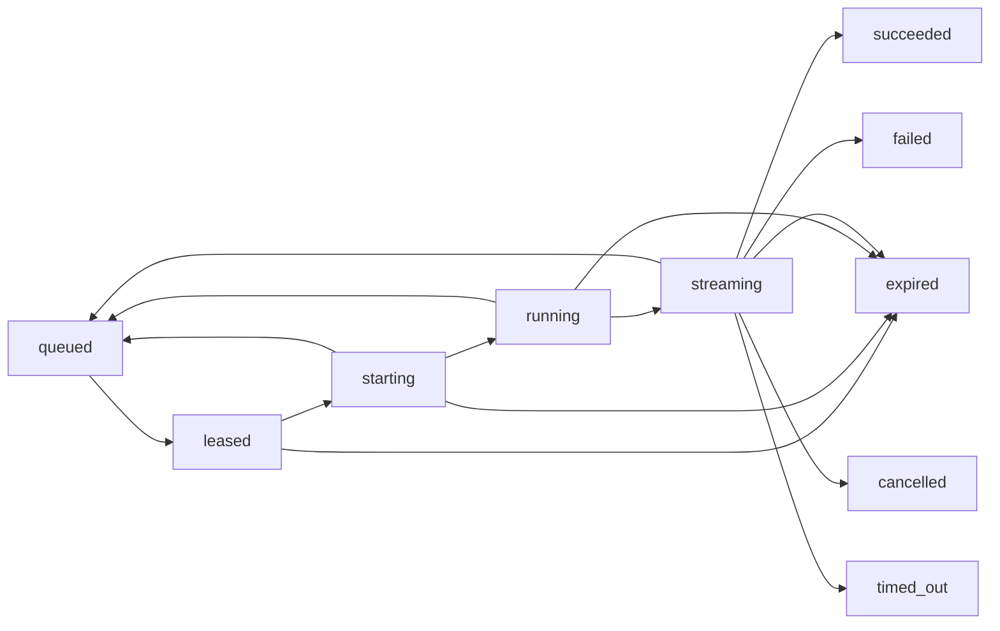

# Hexical AI TTY Production Runtime — Phase 2.0

Phase 2.0 adds the trusted worker execution runtime on top of the Phase 1.8 control plane. Phase 1.8 remains the authority for worker identity, authentication, liveness, lease ownership, and audit attribution. Phase 2.0 adds process execution, state transitions, output persistence, runtime limits, cancellation, recovery, and safe read projections.

## Architecture checkpoint

The Phase 1.8 control-plane and worker-plane APIs are frozen at this integration boundary:

- admission creates a queued job and stores internal literal `argv`;
- the lease manager claims, renews, completes, releases, and recovers authenticated ownership;
- the session store remains the owner/session authority;
- worker identity and lease attribution remain server-side;
- the worker audit stream remains append-only.

Phase 2.0 must integrate through those seams. Process management, output streams, and recovery do not create a second admission or authorization system.

## Runtime lifecycle

`TTYExecutionCoordinator` is the sole execution-state mutator. It claims the authenticated lease, verifies the owned session and admitted job, reserves runtime resources, starts the process, persists internal runtime metadata, consumes both streams, renews the lease, and finalizes the lease before publishing a terminal state.



The active-to-queued transitions are recovery-only transitions. They are used after the recovery worker has cleaned an orphan process and the lease manager has atomically requeued the job. Terminal states are otherwise immutable and idempotent.

State records contain execution/session IDs, timestamps, worker ID, opaque lease ID, exit information, failure code, output counters, and timing metrics. They never contain the secret lease renewal token, process environment, command working directory, or raw process handle.

## Process boundary

`TTYProcessRuntime` is deliberately narrow:

- execution accepts a file plus an `argv` array only;
- `shell: false` is always used;
- `exec()` and command-string interpolation are not used;
- the child receives an explicitly constructed environment, empty unless a trusted worker-side caller supplies values;
- each execution receives a private working directory under the runtime root;
- children are detached into a process group;
- stop/kill address the complete process group, including Windows tree termination;
- cleanup removes the private directory only after the owned process exits;
- orphan cleanup rejects working directories outside the configured runtime root.

Admission converts validated input into literal whitespace-delimited `argv`. Quotes, pipes, redirects, substitutions, and shell operators never acquire shell semantics. The coordinator applies a command allowlist derived from the existing TTY policy classification before starting a process.

## Resource enforcement

`TTYResourceGuard` reserves a process slot before spawn and releases it exactly once. Each reservation enforces:

- maximum concurrent worker processes;
- maximum execution duration with a runtime timer;
- maximum total output bytes;
- independent stdout and stderr byte-rate ceilings.

Output is accounted for before persistence. If a chunk exceeds the remaining ceiling, the accepted prefix is persisted, the process is stopped, and the execution becomes failed with a typed resource failure. Timeout enforcement stops the process itself; abandoning a Promise is not considered cancellation.

## Streaming and backpressure

`TTYOutputStreamManager` writes ordered events to a Redis Stream per execution. Redis `INCR` provides a monotonic per-execution sequence. The coordinator consumes stdout and stderr independently, awaits stream persistence, and therefore applies backpressure rather than buffering unbounded output in memory.

Events include stdout, stderr, state, metric, and completion records. The browser projection exposes only the safe stdout/stderr text and lifecycle state; it does not expose Redis stream IDs, worker IDs, lease IDs, PIDs, paths, or environment values.

## Cancellation and lease loss

`TTYCancellationService` is transport-neutral. A cancellation request reaches the coordinator, which records the requested reason, stops the owned process group, escalates to kill after the grace period, waits for process exit, and only then acknowledges the cancellation. Repeated cancellation is idempotent.

Lease renewal runs independently while the process is alive. A failed renewal or expired lease causes the process to stop and the state to become `expired`; the coordinator does not attempt terminal lease completion after ownership has been lost.

## Recovery

`TTYRecoveryManager` reads the Redis active-execution index and internal runtime metadata. For every starting/running/streaming candidate it:

1. validates the persisted runtime working directory through `TTYProcessRuntime.cleanupOrphan`;
2. terminates the owned process tree if it is still alive;
3. delegates lease recovery and state mutation to `TTYExecutionCoordinator.recoverExecution`.

The coordinator calls the lease manager's atomic expiration recovery. Only after the job is requeued does it reset the execution state to `queued`. If recovery cannot prove lease expiry, it leaves the active state untouched; if recovery fails definitively, it fails closed to `expired`.

## Redis runtime keys

| Key | Type | Purpose |
| --- | --- | --- |
| `tty:execution:{executionId}:state` | JSON string | Coordinator-owned state record. |
| `tty:execution:{executionId}:output` | Redis Stream | Ordered output and lifecycle events. |
| `tty:execution:{executionId}:output-sequence` | Integer | Per-execution event sequence. |
| `tty:execution:{executionId}:runtime` | JSON string | Worker-internal PID, private cwd, handle, and ownership metadata for recovery. |
| `tty:executions:active` | Set | Executions in starting/running/streaming state. |

Runtime metadata is server-only. The browser API never reads or projects it.

## Browser-safe API

`TTYExecutionApi` requires the trusted authenticated owner ID and confirms ownership through `TTYSessionStore.getSession` before reading state or output. It returns:

- execution and session IDs;
- lifecycle state and safe timestamps;
- output counts and last event timestamp;
- queue-wait, startup, and duration metrics;
- sanitized stdout/stderr/state/completion events.

It returns `null` for missing or non-owned executions so ownership cannot be enumerated through response shape.

## Audit and telemetry

Lease events include worker ID, session ID, execution ID, and opaque lease ID. Runtime completion/state audit events include the same safe identity envelope and typed state/failure metadata. No audit event contains a lease token, command environment, PID, cwd, or raw internal exception.

Coordinator runs are wrapped in structured telemetry spans. Operational signals include process starts/stops, lease-renewal failures, output-limit violations, timeout terminations, recovery failures, and accounting/cleanup failures.

## Verification

Focused runtime tests cover:

- illegal and idempotent state transitions;
- real argv-only process execution, environment isolation, stdout/stderr separation, process-group stop, and cleanup;
- concurrency, rate, output, and timeout resource limits;
- ordered Redis output streams;
- coordinator success, cancellation, timeout, output-limit, lease-finalization, and real-process E2E paths;
- orphan recovery and browser-safe ownership projections.

Run the runtime suite with:

```text
npm run test:tty-runtime
```

Run the full control-plane and runtime suite with:

```text
npm run test:tty-all
```

